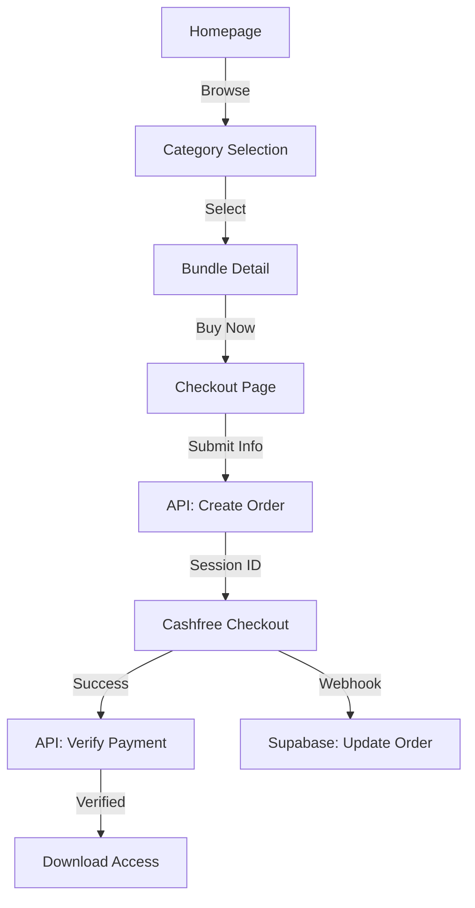
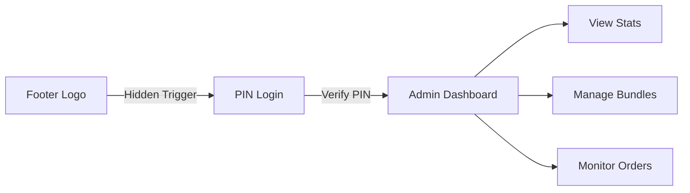

# Project Analysis: ReelStore Technologies

## 🚀 Concept & Objective
ReelStore is a high-end digital marketplace for **Video Reel Bundles**. It focuses on a premium conversion-optimized UX to sell digital assets (Instagram Reels, Marketing Kits) with instant delivery.

---

## 🛠️ Technology Stack

| Layer | Technology | Purpose |
| :--- | :--- | :--- |
| **Framework** | **Next.js 15 (App Router)** | Core architecture & SEO |
| **UI Library** | **React 19** | Component-based interface |
| **Styling** | **Tailwind CSS** | Premium "Glassmorphism" Design System |
| **Database** | **Supabase (PostgreSQL)** | Persistent storage (Bundles, Orders) |
| **Auth** | **PIN-based Static Auth** | Simple, secure Admin access (PIN: 2533) |
| **Payments** | **Cashfree SDK/API** | Localized Indian payment gateway |
| **Analytics** | **Custom Tracker** | Conversion & Funnel monitoring |

---

## 🔄 Core Workflows

### 1. User Journey (Selection to Delivery)

### 2. Admin Management Flow

---

## 📂 Architecture Highlights

- **Infrastructure**: Hosted on **Netlify** with Serverless functions handling payment logic.
- **Data Layer**: Centralized `reelstoreService` using Supabase for all CRUD operations with built-in caching.
- **Design System**: Atomic components (`AppLogo`, `AppIcon`, `AppImage`) ensuring visual consistency.
- **Security**: 
    - Secure checksum verification for payments.
    - PIN-based admin session persistence (30 days).
    - Environment-agnostic Cashfree integration (Sandbox/Production).

---

## 📈 Optimization Points
- **Performance**: High use of React `Suspense` and image optimization via `AppImage`.
- **Conversion**: One-page checkout with native India-first payment options (UPI, Cards).
- **Maintenance**: Schema-driven bundle management via Supabase UI & Admin Dashboard.

---
*Documented by Antigravity AI*
